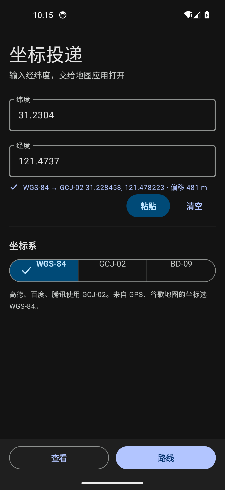
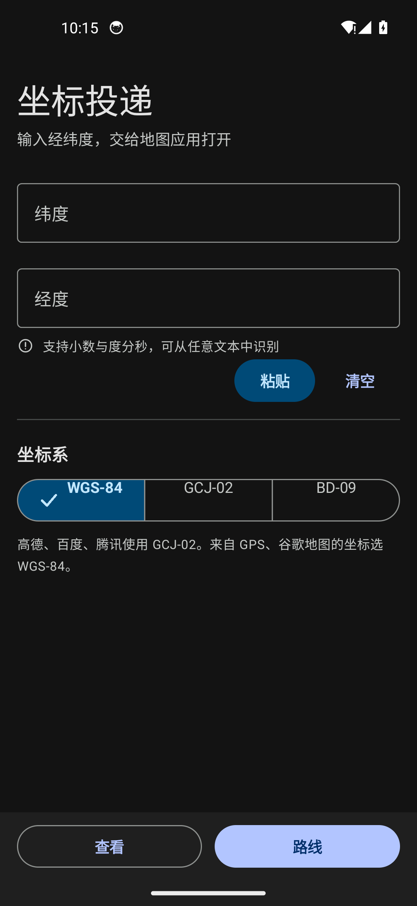
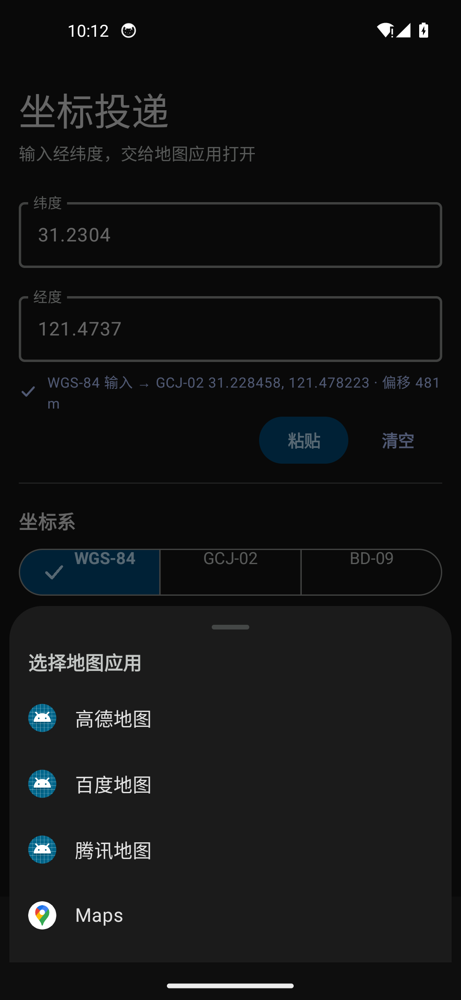
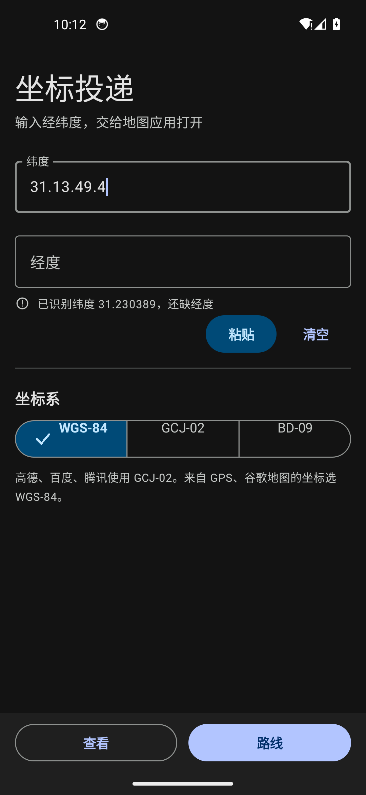
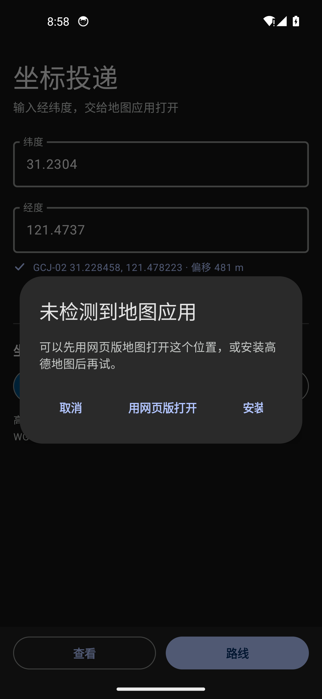
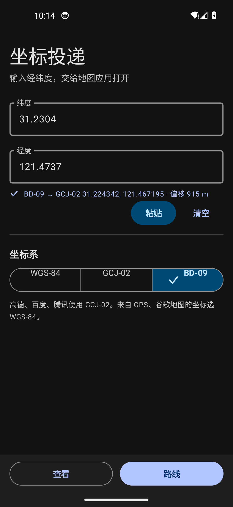

# 坐标投递 · CoordCast

[**⬇ 下载 APK**](https://github.com/PassersbyfromChina/CoordCast/releases/latest) ·
[最新发布](https://github.com/PassersbyfromChina/CoordCast/releases) ·
[全部源码](https://github.com/PassersbyfromChina/CoordCast)

把**任意格式**的经纬度，**投递**给**任意一个**地图应用。

粘贴 `31°13'49.4"N 121°28'25.3"E`、`31.13.49.4`、`31-13-49.4`、`311349.4N`、
`北纬31度13分49.4秒` 或 `31.2304,121.4737`，它都能认出来、换算好坐标系，
再交给高德 / 百度 / 腾讯 / Google，或手机上任何一个认得 `geo:` 的地图应用。

> **这个应用自己不带导航功能。** 它做的事情只有三件：认坐标、换坐标系、把坐标投给别的
> 地图应用。路线规划和导航全部由接收方——高德、百度、腾讯、Google——完成。
> 名字里的「投递」就是这个意思。

> ### 🤖 这是 AI 写的
>
> **本项目的全部代码、测试、文档与界面设计均由 AI 生成**（DeepSeek Harness 上的 coding
> agent），人类提出需求、反馈问题并验收结果。设计方案、深链格式、坐标系处理和 Material 3
> 的实现依据都可以在 [`docs/research/`](docs/research/) 里追溯到来源。
>
> 因此：请把这里的代码当成**一份可用的参考实现**，而不是经过团队评审的生产代码。
> 每一处声称"验证过"的地方都在 [实机验证](#实机验证) 里写明了验证方式与局限。



<table>
<tr>
<td width="33%"></td>
<td width="33%"></td>
<td width="33%"></td>
</tr>
<tr>
<td align="center">冷启动</td>
<td align="center">M3 模态底部面板</td>
<td align="center">输入 <code>31.13.49.4</code>，只进纬度栏</td>
</tr>
</table>

- **115 KB**，零第三方库、零网络权限、**零 API Key**
- minSdk 24（Android 7.0）／targetSdk 35（Android 15）
- **Material 3 Expressive** 界面（Android 16/17 的设计语言）
- 识别引擎与地图调起**拆成了可直接复用的库**，见 [作为库使用](#作为库使用)

---

## 目录

- [安装](#安装)
- [使用](#使用)
- [支持的地图应用](#支持的地图应用)
- [输入识别](#输入识别)
- [坐标系](#坐标系)
- [作为库使用](#作为库使用) ← 其他开发者看这里
- [界面：Material 3 Expressive](#界面material-3-expressive)
- [实机验证](#实机验证)
- [从源码构建](#从源码构建)
- [工程结构](#工程结构)
- [已知限制](#已知限制)
- [隐私](#隐私)
- [许可](#许可)

## 安装

下载 [`dist/CoordCast-1.7.1.apk`](dist/CoordCast-1.7.1.apk)，传到手机点开安装。

也可以从 [Releases](https://github.com/PassersbyfromChina/CoordCast/releases/latest) 页面下载——
那里同样挂着三个库 jar。两条路径给的是同一个文件（下面这个哈希对两者都成立）：

APK 是自签名包（不是应用商店版本），手机需要允许「安装未知来源应用」。

```
版本    1.7.1 (versionCode 13)
大小    121,477 字节
SHA-256 C5C00D81EACAC795B1B70E5C144EEA092A5CA89EAA758AB976431B8D875ED6DF
签名    APK Signature Scheme v2 + v3
权限    无（安装时权限列表为空）
```

校验下载是否完整：

```bash
sha256sum CoordCast-1.7.1.apk                      # Linux / macOS
certutil -hashfile CoordCast-1.7.1.apk SHA256      # Windows
```

> 构建是**逐字节可复现的**：`tools/src/ZipTool.java` 给所有 zip 条目写入同一个固定时间戳，
> 所以同一份源码配同一套工具链，构建出来的 APK 哈希就是上面这个值——你可以自己构建一遍核对。
> 三个 jar 同理（`jar` 工具会给每个条目写文件时间戳，所以它们也过一遍 ZipTool 重打包）。
> （这一点原来是不成立的，旧版 README 写的是"哈希只对发布的这份有效"，已经改掉了。）

## 使用

1. **纬度**、**经度**分两栏输入（或者直接往任意一栏粘贴一整串）。
2. 下方支持性文本实时显示识别结果和换算后的坐标。
3. 点底部操作栏里的 **查看** 或 **路线**。
4. 装了多个地图应用时弹出底部面板；只装了一个就直接打开。

其他应用分享过来的文本也能收：在聊天、备忘录里选中坐标 → 分享 → 坐标投递。

## 支持的地图应用

| 应用 | 查看 | 路线 | 投喂的坐标系 |
|---|---|---|---|
| 高德地图 | `androidamap://viewMap` | `amapuri://route/plan/` | GCJ-02（`dev=0`） |
| 百度地图 | `baidumap://map/marker` | `baidumap://map/direction` | GCJ-02（`coord_type=gcj02`） |
| 腾讯地图 | `qqmap://map/marker` | `qqmap://map/routeplan` | GCJ-02 |
| Google 地图 | `geo:0,0?q=` | `google.navigation:q=` | GCJ-02 |
| **其他任意地图应用** | `geo:` | `geo:` | WGS-84 |

最后一行是**动态发现**的：凡是能处理标准 `geo:` URI 的应用都会出现在面板里，
名字和图标取应用自己声明的。花瓣地图、OsmAnd、HERE 这些没有专门写代码的也能用。

一个都没装时弹出兜底对话框，可以用网页版打开，不会崩。



## 输入识别

### 支持的写法

```
31.2304, 121.4737                   十进制
31.2304 121.4737                    空格分隔
31.2304                             单个值，自动进纬度栏
121.4737                            数值 > 90，自动进经度栏
121.4737,31.2304                    顺序写反也能纠正
纬度 31.2304 经度 121.4737           中文标签
我的位置：lat 31.2304 lng 121.4737    任意前缀
N31.2304 E121.4737                  前置半球字母
31.2304N,121.4737E                  后置半球字母
31°13'49.4"N 121°28'25.3"E          度分秒
31°13′49.4″N 121°28′25.3″E          Unicode 撇号
31°13.823'N 121°28.42'E             度 + 小数分
北纬31度13分49.4秒 东经121度28分25.3秒  中文度分秒
31 13 49.4 N  121 28 25.3 E         无任何符号，空格分隔
311349.4N 1212825.3E                紧凑 DDMMSS.ss
31.13.49.4  121.28.25.3             度分秒用小数点分隔
31-13-49.4  121-28-25.3             度分秒用横线分隔
31/13/49.4  121:28:25.3             斜杠 / 冒号同样可以
地址：上海市黄浦区人民大道200号 坐标 31.2304,121.4737
```

换行、逗号、分号、竖线、斜杠、制表符、全角标点都可以做分隔符。


### 三条判定规则

1. **一串被 `.` `-` `/` `:` 连起来的数字按一个角度整体解析**，绝不拆成两个数。
   `31.13.49.4` = 31°13'49.4"；`31.2304` 只有一个点，仍然是小数。
   日期（`2024-10-07`）、电话（`138-1234-5678`）这类读不出合法角度的串会被整体忽略。
2. **换行是硬边界**。度分秒必须落在同一行里；跨行的半截角度（`31 13` ↵ `49.4 N`）
   不会被悄悄拼成一个值。反过来，一行一个完整角度（`31.13.49.4` ↵ `121.28.25.3`）正常工作。
3. **纬度/经度按整段文本整体判定**，而不是逐个数字猜：先看半球字母和标签，再看全部数字中
   哪一种「谁当纬度、谁当经度」的组合最合理（是否越界、是否落在中国境内、是否相邻），
   最后才退回默认的「第一个是纬度」。所以 `3号楼 31.2304, 121.4737` 里那个 3 不会被当成纬度。

### 粘贴是怎么处理的

**同一行的经纬度是正确的输入**，不是需要用户自己拆开的错误格式：

| 粘到哪一栏 | 结果 |
|---|---|
| 纬度栏粘 `31.2304,121.4737` | 纬度 = 31.2304，经度 = 121.4737 |
| 经度栏粘 `31.2304,121.4737` | 同上（不分先后） |
| 纬度栏粘 `31.13.49.4 121.28.25.3` | 31.230389 / 121.473694 |
| 纬度栏粘 `31.2304,121.4737` 后点经度栏 | 焦点离开时自动拆到两栏 |
| 纬度栏粘 `121.4737`（只有一个经度） | 自动落到经度栏 |
| 经度栏原本有值、往纬度栏粘一个纬度 | 两栏各保留各的，不会被清掉 |

三条规则：

1. **只认「真粘贴」**：文本选择菜单的粘贴、系统粘贴快捷键、键盘自带剪贴板面板、
   「粘贴」按钮、其他应用分享过来——都算。打字打到一半绝不会被改写或搬走。
2. **两条路都能认出来**。系统粘贴菜单会走 `onTextContextMenuItem` 钩子；键盘自己的剪贴板面板
   不走这个钩子，只表现为「一次插入了一串带数字的字符」，所以两种信号都认。
   要求插入内容里带数字，是为了不误伤输入法上屏、自动纠错、滑动输入。
3. **优先读「实际落进输入框的内容」，读不出来才回退到系统剪贴板**。

### 提示信息

| 情况 | 提示 |
|---|---|
| 只填了一栏 | 已识别纬度 31.2304，还缺经度 |
| 填反了 | 纬度和经度似乎填反了（离开输入框时自动换位） |
| 分/秒越界 | 分或秒需在 0–60 之间 |
| 数值越界 | 数值超出经纬度范围（±90 / ±180） |
| 没识别到 | 没有识别到经纬度 |
| 一切正常 | ✓ GCJ-02 31.228458, 121.478223 · 偏移 481 m |

## 坐标系

高德、百度、腾讯用的都是国测局加密坐标系体系，GPS 和谷歌地球用的是 WGS-84。
选错了位置会偏 300–600 米，所以这一项必须选对。

| 坐标系 | 用在哪 |
|---|---|
| **WGS-84**（默认） | GPS 原始数据、GeoJSON、谷歌地球 |
| **GCJ-02** | 高德地图、腾讯地图、中国区的 Google 地图 |
| **BD-09** | 百度地图 |

### 交接时每个应用实际拿到什么

| 目标 | 拿到 | 为什么 |
|---|---|---|
| 高德 | GCJ-02，带 `dev=0` | `dev=0` 就是告诉高德「已经是加密坐标，不用再转」 |
| 百度 | GCJ-02，带 `coord_type=gcj02` | 百度支持直接收 GCJ-02 并自己转 BD-09，比本地转更可靠 |
| 腾讯 | GCJ-02 | 腾讯地图用 GCJ-02 |
| Google | GCJ-02 | 中国区瓦片是 GCJ-02 对齐的，喂 WGS-84 会偏约 500 m；中国以外两者相同 |
| 其他（`geo:`） | WGS-84 | `geo:` URI 的标准（RFC 5870）就是 WGS-84 |

---

## 作为库使用

项目从 1.4.0 起拆成三个**互相独立、都能直接拿走**的模块。构建时会和 APK 一起打出三个 jar，
**内容与 APK 里跑的是同一份编译产物**，不存在"文档和实现不一致"的问题。

| 模块 | 依赖 | 做什么 | 产物 |
|---|---|---|---|
| **`castcore`** | **纯 Java，零 Android** | 文本 → 经纬度；WGS-84 / GCJ-02 / BD-09 互转 | `castcore-1.7.1.jar` |
| **`castmap`** | Android + castcore | 发现装了哪些地图应用、拼深链、拉起 | `castmap-1.7.1.jar` |
| **`castui`** | Android，无其他依赖 | Material 3 Expressive 组件 | `castui-1.7.1.jar` |

三个模块都**不带资源文件**（M3 组件全部代码绘制），所以是普通 jar，不是 AAR——
丢进任何 Android 工程就能用，不需要合并资源。

### castcore：识别 + 坐标系换算

```java
import com.coordcast.castcore.CoordText;
import com.coordcast.castcore.CoordPoint;
import com.coordcast.castcore.CoordSystem;

// 1. 给什么都能认，不抛异常
CoordText.Scan scan = CoordText.scan("上海市…200号 31.13.49.4 121.28.25.3");
if (scan.complete()) {
    double lat = scan.latitude;      // 31.230389
    double lng = scan.longitude;     // 121.473694
    String raw = scan.latRaw;        // "31.13.49.4" —— 原文是哪一段
}

// 2. 坐标系：说清楚输入是什么，要什么自己挑
CoordPoint p = new CoordPoint(lat, lng, CoordSystem.WGS84);
double[] gcj = p.gcj02();            // 交给高德/腾讯/中国区 Google
double[] bd  = p.bd09();             // 交给百度
double[] wgs = p.wgs84();            // 交给 geo: / OSM 系应用
double shift = p.shiftMeters();      // 偏移了多少米，用来判断基准选错了没有

// 3. 单独用换算也行
double[] wgs2 = GeoConverter.convert(lat, lng, CoordSystem.GCJ02, CoordSystem.WGS84);
```

`CoordText.Issue` 会告诉你为什么没认出来（`EMPTY` / `PARTIAL` / `MINUTES` / `RANGE`），
可以直接映射成自己应用的提示文案。

### castmap：拉起地图应用

```java
import com.coordcast.castmap.MapApp;
import com.coordcast.castmap.MapAppFinder;
import com.coordcast.castmap.MapLinks;
import com.coordcast.castmap.AmapLauncher;

// 1. 装了哪些？（已处理 Android 11+ 包可见性，见下方 note）
List<MapAppFinder.Entry> apps = MapAppFinder.find(context);
// Entry: app(类型), packageName, label, icon —— 直接拿去画自己的选择列表

// 2. 拼深链。每个应用给的是它自己文档里的那一个 scheme
double[] c = MapApp.AMAP.wantsGcj02() ? gcj : wgs;
String view  = MapLinks.view(MapApp.BAIDU, "目的地", c[0], c[1]);
String route = MapLinks.route(MapApp.BAIDU, "目的地", c[0], c[1]);

// 3. 拉起（带可用性检查和异常兜底）
AmapLauncher.launch(context, route, "com.baidu.BaiduMap");
```

三个方法都**不碰 Android**，可以在桌面 JVM 上单元测试：`MapLinks`、`MapApp`、`AmapUris`
是纯字符串处理。真正需要 `android.*` 的只有 `MapAppFinder` 和 `AmapLauncher`。

> **必须加 `<queries>`**：Android 11+ 不声明包可见性的话，`PackageManager` 一个应用都看不到，
> `find()` 会返回空列表。照抄 [`app/AndroidManifest.xml`](app/AndroidManifest.xml) 里那段。

### castui：Material 3 Expressive 组件

```xml
<com.coordcast.castui.CastTextField
    android:id="@+id/field_latitude"
    android:layout_width="match_parent"
    android:layout_height="56dp">
    <EditText android:id="@+id/input_latitude" />
</com.coordcast.castui.CastTextField>

<com.coordcast.castui.CastSegmentedButton
    android:id="@+id/seg"
    android:layout_width="match_parent"
    android:layout_height="40dp" />

<com.coordcast.castui.CastButton
    android:id="@+id/btn"
    android:layout_width="wrap_content"
    android:layout_height="40dp"
    android:text="路线" />
```

```java
field.setLabel("纬度");                                  // 浮动标签，切进边框缺口
seg.setItems(new String[]{"WGS-84", "GCJ-02", "BD-09"}, 0);
seg.setOnSegmentSelected(i -> { ... });
((CastButton) findViewById(R.id.btn)).setVariant(CastButton.FILLED);  // TONAL/OUTLINED/TEXT/ELEVATED

// 调色板：组件不带资源，角色由宿主应用提供
CastColor scheme = CastColor.get();
scheme.primary = 0xFFFFD8E4;
```

`CastColor`（M3 颜色角色）、`CastType`（完整字号阶梯）、`CastShape`（圆角阶梯 + 形变）、
`CastMotion`（两族弹簧 + 缓动 + 时长）都是独立可用的，不依赖任何组件类。

### 跑一遍示例

[`samples/Sample.java`](samples/Sample.java) 是一个三十行的完整例子，
`tools/build.ps1` 每次构建都会用它**只对着 jar** 编译一遍——如果公开 API 用不了，构建就会失败。

```bash
javac -cp "dist/castcore-1.7.1.jar;dist/castmap-1.7.1.jar" -d out samples/Sample.java
java  -cp "dist/castcore-1.7.1.jar;dist/castmap-1.7.1.jar;out" Sample
```

输出：

```
latitude  = 31.230389   (from "31.13.49.4")
longitude = 121.473694   (from "121.28.25.3")
DMS       = 31°13'49.4"N
GCJ-02    = 31.228447, 121.478218   (shifted 481 m)
BD-09     = 31.234300, 121.484776

高德地图
  view  androidamap://viewMap?…&lat=31.228447&lon=121.478218&dev=0
  route amapuri://route/plan/?…&dlat=31.228447&dlon=121.478218&dev=0&t=0&m=0
百度地图
  view  baidumap://map/marker?location=31.228447,121.478218&coord_type=gcj02&src=andr.coordcast
  …
```

---

## 界面：Material 3 Expressive

> **1.5.0 换掉了整个界面层。** 之前几版做的是 iOS 26 "Liquid Glass" 的模拟（抓背景 +
> AGSL 折射着色器），在实际设备上出了一堆渲染问题：首帧要编译着色器管线、背景抓取吃主线程、
> AGSL 在某些设备上编译失败后静默降级、高光方向取决于重力朝向导致观感随机。
> 现在**整个 UI 层重写为 Material 3 Expressive**，也就是 Android 16/17 的设计语言——
> 全部是标准 Canvas 绘制，没有背景抓取、没有运行时着色器、没有降级档。

### 颜色：Google 自己的深色方案，不是 M3 基线

M3 是**基于角色**的系统：组件永远不引用调色板里的原始色值，只引用语义角色
（`primary`、`onPrimary`、`surfaceContainerHigh`、`outline`…）。换一套配色或从壁纸取色，
所有组件自动跟着变。

但**默认值用的不是 M3 基线的紫色调**。基线参考主题是 `#D0BCFF` 配 `#141218`——
偏紫、偏冷——**没有一个 Google 应用实际长这样**。1.7.0 起改用 Google 自己应用的实测值：
拿 Play 商店、Google 翻译、Google 地图、Google 地球、Gboard 这五个应用的深色截图，
逐像素采样出来的。它们在这两件事上完全一致：**中性灰底 `#131313`**，
以及**淡紫蓝强调色 `#B2C5FF`**。

| 角色 | 值 | 采自 | 用在哪 |
|---|---|---|---|
| `surface` | `#131313` | Play 商店 / 地球 / 地图 三者最大面积像素 | 屏幕底色 |
| `primary` / `onPrimary` | `#B2C5FF` / `#002E69` | Gboard「添加键盘」、翻译麦克风按钮 | 主按钮、"路线" |
| `secondaryContainer` / `onSecondaryContainer` | `#004A77` / `#C2E7FF` | 地球的按钮与横幅 | 选中段、tonal 按钮 |
| `onSurface` / `onSurfaceVariant` | `#E3E3E3` / `#C4C7C5` | Gboard 标题 / 副标题 | 正文 / 次要文本 |
| `surfaceContainerHigh` | `#2A2A2A` | Play 商店卡片层 | 对话框 |
| `outline` / `outlineVariant` | `#8E918F` / `#444746` | 地图顶部胶囊 `#393939` 家族 | 输入框边框 / 分隔线 |
| `error` | `#F2B8B5` | — | 校验失败 |

采样脚本留在调研记录里可复现；`app/res/values/colors.xml` 与 `CastColor.dark()` 是同一组值。

### 状态层：M3 的招牌交互

M3 **不用换填充色来表示 hover / press**，而是在静止填充之上盖一层内容色的半透明**状态层**
（hover 8%、press 10%、drag 16%）。这一条实现在 `CastColor.hover/pressed/dragged`、
`CastButton` 的 `RippleDrawable`，以及分段按钮按下时的 10% 蒙层里。
它天然适配明暗两套主题——这就是为什么 M3 不能靠"把颜色调深一点"来做按压态。

### 组件

| 组件 | 规格 |
|---|---|
| **CastButton** | 五种变体（filled / tonal / elevated / outlined / text），高 40dp，胶囊形，Label Large；按下时**圆角张开**（Expressive 形变） |
| **CastTextField** | outlined 输入框：1dp `outline` → 聚焦 2dp `primary`；标签上浮并**切进边框缺口**（缺口是真的路径断开，不是盖一层背景色，所以在任何底色上都对） |
| **CastSegmentedButton** | 单选分段按钮，严格照 androidx `material3.SegmentedButton`：每个段是**自己的**容器，选中段**原地**填 `secondaryContainer`；18dp 勾从**自身左下角**缩放淡入；标签右移半个「勾+间距」；段间 1dp `outline`；只可点击，**没有任何会滑动的东西** |
| **模态底部面板** | `surfaceContainerLow`，顶角 28dp，32×4dp 拖拽把手，56dp 列表项；从屏幕底边用强调减速曲线升起 |
| **对话框** | `surfaceContainerHigh` + 28dp 圆角，无描边（靠高度分层），动作是右下角的文本按钮 |



#### 1.7.0 修掉的三个 UI 缺陷

这三个都是**看图才能发现**的问题，不是编译能拦住的：

1. **冷启动时分段按钮看不见滑块。** `setItems()` 在 `onCreate` 里调用，那时 `getWidth()`
   还是 0，算出的药丸宽度就是 0；而 `onLayout` 只在**位置**变化时才同步，位置是 0→0
   所以宽度永远没被修正，直到你点一下才有东西被画出来。现在 `onLayout` 连宽度一起比对，
   `onDraw` 里也做了兜底自愈。
2. **输入框的标签被切掉上半截。** 浮动标签原来摆在 `y = -h/2`，指望
   `setClipChildren(false)` 让它溢出显示——**没生效**，字的上半部分被输入框自己的边界
   切平了。现在给 `CastTextField` 在顶部多留 8dp 作为标签专用区（`onMeasure` 里把声明的
   56dp 当容器高度，额外加上这 8dp），标签始终画在自己边界内。
3. **光标和"纬度"不在同一高度。** 输入框内边距原来是上 24dp / 下 8dp，把文字压低了约 7dp。
   改成上下对称 12dp + `CENTER_VERTICAL`，静止标签和光标就落在同一条中线上。

#### 1.7.1：分段按钮重写（之前的滑块不是谷歌的设计）

1.7.0 里那个"会动的药丸"**是我自己发明的，不是 M3**。单拇指在段之间滑动是 iOS 的做法；
查 androidx 的 `material3.SegmentedButton` 源码可以确认，M3 里**每个段是独立的 Surface**，
选中段只是**在原地**把容器填上 `secondaryContainer`，唯一的动效是勾的入场
（`fadeIn + scaleIn(initialScale = 0, transformOrigin = (0, 1))`，也就是从**自己的左下角**长出来）
和标签为腾出位置而位移。段之间没有任何东西在移动。

滑块的写法还带来了一串本可避免的问题，这次一并消失：

- 位置和宽度要跟布局同步——而 `setItems()` 在 `onCreate` 里跑，那时宽度还是 0，
  冷启动就**什么都看不见**（1.7.0 只是打了个补丁，1.7.1 把状态本身去掉了）。
- 拖动可以**误改**坐标系——现在拖动只取消按压，绝不改选择。
- 触摸处理复杂到可能吞掉本属于父级 ScrollView 的手势。

另外把读数改清楚了。原来无论你选哪个坐标系，读数**永远只显示 GCJ-02**——
选了 BD-09 却看到一串 GCJ-02，看起来就像选择被忽略了。现在会先说你选的是什么：

```
WGS-84 → GCJ-02 31.228458, 121.478223 · 偏移 481 m
GCJ-02 31.230400, 121.473700 · 无需换算
BD-09 → GCJ-02 31.224342, 121.467195 · 偏移 915 m
```

单位前的空格换成了不换行空格，"915 m" 不会再被折行拆开。


### 动效：两族弹簧

M3 Expressive 的运动分两族，用错族就会"手感不对"：

- **Spatial**（位移、尺寸、旋转）——带一点回弹的弹簧，因为运动本身就是反馈
- **Effects**（颜色、透明度）——临界阻尼，绝不过冲

`CastMotion` 用阻尼振子的解析闭式实现，既能直接当 `ValueAnimator` 的插值器，也不需要逐帧积分。
阻尼比直接取 androidx `material3` 的 `ExpressiveMotionTokens`：

| token | damping | stiffness |
|---|---|---|
| SpringDefaultSpatial | **0.8** | 380 |
| SpringFastSpatial | **0.6** | 800 |
| SpringSlowSpatial | **0.8** | 200 |
| SpringDefaultEffects | **1.0** | 1600 |

注意 fast spatial 的阻尼是 **0.6，比默认的 0.8 更小**——也就是说"快"的那一族弹簧弹得**更厉害**，
它的快来自刚度而不是阻尼。（这一条我一开始写反了，后来对着 token 原文才改正。）
另外提供 M3 的时长阶梯（50–600ms）和强调缓动曲线。

**Reduce Motion**：系统关掉动画时，形变、按压位移、面板升起全部跳过。

### 为什么不用 Liquid Glass 了

不是审美取舍，是工程判断：

| | Liquid Glass（≤1.4.0） | Material 3（1.5.0） |
|---|---|---|
| 每帧成本 | 抓背景 + 模糊 + 着色器 | 普通 Canvas 绘制 |
| 首帧 | 需编译 GPU 管线（模拟器上约 1–2 秒） | 无额外成本 |
| 设备差异 | AGSL 要 API 33+，失败静默降级，还踩过 `half` 是保留字 | 无分级，全版本一致 |
| 可预测性 | 高光方向取决于重力传感器，观感随机 | 完全确定 |

Material 3 是 Android 的原生语言，在这台设备上就是"应该长这样"。

## 实机验证

在 **Android 14 (API 34) x86_64 模拟器**上安装运行。

| 验证项 | 结果 |
|---|---|
| 冷启动 | 无崩溃，界面完整渲染（[01-empty.png](docs/screenshots/01-empty.png)） |
| 输入框 | outlined 边框 + 标签切进缺口，聚焦时边框变粗变 `primary` |
| 支持性文本 | 识别成功后转为 `primary` 并显示 GCJ-02 坐标与偏移量 |
| 分段按钮 | 选中段药丸正确，切换后坐标系生效 |
| 按钮层级 | 查看=outlined、路线=filled、粘贴=tonal、清空=text |
| 模态底部面板 | 4 个应用（高德/百度/腾讯/Maps），**图标保持各自原色**（曾被 tint 成单色，已修） |
| 无地图应用 | 弹出 M3 对话框，标题「未检测到地图应用」 |
| 输入识别回归 | `31.13.49.4` 只进纬度栏；`31.13.49.4 121.28.25.3` → 31.230389/121.473694；`3号楼 31.2304, 121.4737` → 31.2304/121.4737 |
| 崩溃 | `FATAL EXCEPTION` / `ANR` 均为 0 |
| 可复现 | 同一份源码连构建两次，APK 哈希完全一致；实机验证装的就是这个哈希 |
| 单元测试 | 305 条断言全过（`tools/run-core-tests.ps1`） |

### 关于验证的边界

- **只在模拟器上测过，没有真机。** 模拟器的 GPU 是 `swiftshader_indirect`（纯 CPU 软件
  渲染），所以每次冷启动的首帧会有一次约 700–1000ms 的掉帧——这是软件光栅化一整屏的代价，
  换成 Material 3 之后已经比 Liquid Glass 版本（约 1.9s）好了一半。**稳态没有任何掉帧**，
  真机上这个数字应该小一到两个数量级，但**我没有真机可以验证这个推断**。
- 深链的**内容**（每个应用收到什么 URI）在 1.3.0 时用替身 APK 逐条核对过，见下方附录；
  之后没有再改动深链代码。
- 腾讯地图的 `qqmap://` 没带开发者 key，无法在模拟器上验证真实腾讯地图的反应。
- **模拟器刚启动时 `system_server` 自己会 ANR**（弹 “Process system isn’t responding”）。
  这个对话框属于 `android` 包、不属于本应用，但它会挡住 `uiautomator` 的界面树，
  让自动化脚本看起来像"应用根本没渲染出来"。验证脚本现在会先按 `android:id/aerr_wait`
  把它点掉，再对我们的窗口做断言——早先有一轮就把这个当成了应用的问题。

#### 附：深链验证（1.3.0，API 30 模拟器）

用 4 个测试替身 APK（真实包名 + 真实 scheme 注册）加模拟器自带的 Google 地图，
逐个点开核对实际收到的链接：

| 点了哪个 | 实际收到 |
|---|---|
| 高德 · 路线 | `amapuri://route/plan/?…&dlat=31.228458&dlon=121.478223&dev=0&t=0&m=0` |
| 百度 · 路线 | `baidumap://map/direction?destination=latlng:31.228458,121.478223\|name:坐标点&coord_type=gcj02&src=andr.coordcast` |
| 腾讯 · 路线 | `qqmap://map/routeplan?type=drive&fromcoord=CurrentLocation&tocoord=31.228458,121.478223&to=坐标点` |
| 其他 · 路线 | `geo:31.230400,121.473700?q=…` ← WGS-84 |
| Google · 查看 | `geo:0,0?q=31.228458,121.478223(坐标点)`，Google 地图成为前台 |

输入是 WGS-84 的 `31.2304, 121.4737`。四个用 GCJ-02 的目标都收到换算后的
`31.228458, 121.478223`，走 `geo:` 的收到原始值——**每个应用拿到自己该拿的坐标系，是实测的**。

## 从源码构建

不用 Gradle，脚本直接调 SDK 工具链，方便看清每一步在做什么。

### 需要

- 完整 JDK 17（`javac --release 8` 需要 `lib/ct.sym`，精简 JRE 没有）
- Android SDK：`build-tools;35.0.0`、`platforms;android-35`、`platform-tools`

```powershell
$env:JAVA_HOME = 'C:\path\to\jdk-17'
$env:ANDROID_SDK_ROOT = 'C:\path\to\android-sdk'

# 构建 APK + 三个 jar + 用 samples/Sample.java 对着 jar 编译一遍
powershell -ExecutionPolicy Bypass -File tools\build.ps1
powershell -ExecutionPolicy Bypass -File tools\build.ps1 -VersionName 1.5.1 -VersionCode 10

# 单元测试（不需要 Android SDK）
powershell -ExecutionPolicy Bypass -File tools\run-core-tests.ps1
```

流程：`aapt2 compile` → `aapt2 link` → `javac --release 8` → `d8` →
合并 `classes.dex` → `zipalign` → `apksigner` → 三个模块各打一个 jar。

### 签名

本仓库**不含签名密钥**（公开仓库里的密钥等于让任何人都能伪造你的更新），`keystore/` 在
`.gitignore` 里。`tools/build.ps1` 发现 `keystore/coordcast.jks` 不存在时会**自动用 keytool
生成一个**，所以克隆下来直接构建就能出可安装的 APK。想用自己的密钥就先手工生成：

```bash
keytool -genkeypair -v -keystore keystore/coordcast.jks -alias coordcast \
  -keyalg RSA -keysize 2048 -validity 10000
```

> **密钥要自己备份好**——换了密钥，手机就会拒绝覆盖安装。
> 仓库里发布的那个 APK 用的是作者自己的密钥，你重新构建的签名不同，需要先卸载旧版。

> **Windows 路径提醒**：`aapt2` 打不开含中文的目录，`adb pull` 也无法在这种路径下创建文件
> （截图时就踩了这个坑，最后是走 ASCII 目录联接写进去的）。`tools/build.ps1` 检测到这种路径时，
> 会自动建一个 ASCII 目录联接再构建，产物仍然写回 `dist/`。

## 工程结构

```
app/
  AndroidManifest.xml          清单：0 权限，声明 <queries> 以便发现地图应用
  java/com/coordcast/
    castcore/                  【模块 1】纯 Java，无 android import
      CoordText.java             文本 → 经纬度（手写分词器 + 语法）
      GeoConverter.java          WGS-84 / GCJ-02 / BD-09 互转
      CoordPoint.java            一个点 + 它原本的坐标系
      CoordSystem.java           三个坐标系的枚举
      FieldBinder.java           两栏分配策略：粘贴 / 拆分 / 搬移
      Formats.java               数字格式化
    castmap/                   【模块 2】Android：把坐标交给地图
      MapApp.java                支持的应用：包名 + 需要的坐标系
      MapLinks.java              每个应用的深链与网页兜底
      AmapUris.java              高德专用（深链格式最复杂）
      MapAppFinder.java          用 PackageManager 发现装了哪些
      AmapLauncher.java          Intent 组装、可用性检查、异常兜底
    castui/                    【模块 3】Android：Material 3 Expressive
      CastColor.java               颜色角色（含状态层的合成规则）
      CastType.java                字号阶梯
      CastShape.java               圆角阶梯 + 形变动画
      CastMotion.java              空间/效果两族弹簧、缓动、时长阶梯
      CastButton.java              五种变体的按钮
      CastTextField.java           outlined 输入框 + 缺口浮动标签
      CastSegmentedButton.java     单选分段按钮
    app/                       示例应用
      MainActivity.java          两栏输入、内联反馈、应用选择、inset
      CoordEditText.java         只在"真粘贴"时通知宿主
  res/                         布局、图标、M3 颜色角色（组件本身不用资源）
samples/
  Sample.java                  三十行示例，构建时会对 jar 编译验证
tools/
  build.ps1                    APK + 3 个 jar + 示例编译检查
  run-core-tests.ps1           桌面单元测试
  fetch.ps1                    大文件下载
  restore-toolchain.ps1        重新拉取 JDK 17 与 Android SDK 工具
  src/CoreTests.java           305 条断言
  src/ZipTool.java             合并 classes.dex 进 aapt2 的 APK，并统一时间戳保证可复现
  src/IconGen.java             用 Java2D 生成各密度启动图标
docs/
  screenshots/                 实机截图
  research/                    调研原始记录（含结论报告与出处）
dist/                          APK 与三个 jar
```

`castcore` 里**没有任何 `import android`**——`tools/run-core-tests.ps1` 直接把它编译到
桌面 JVM 上跑，这一点每次跑测试都会被验证。

## 已知限制

- 只支持**单个点**。「查看 / 路线」都作用于这一组经纬度。
- **腾讯地图的调起没带开发者 key**（官方文档标为必填，但腾讯自己的示例不带）。
  装了腾讯地图时它仍会出现，若某个版本拒绝无 key 调起，会退回网页版。
- **Google 地图在中国区按 GCJ-02 投喂**；中国区之外两个坐标系本来就相同，不受影响。
- 百度只做了「标记」和「路线规划」，没有用它专有的 `map/navi` 直接起导航。
- `geo:` 没有「规划路线」这个动作，所以从「路线」进其他地图应用时，是打开到该点、
  由用户在那里起导航。
- 紧凑格式 `311349.4N` 仅在整数部分为 6–7 位且带半球字母时按 DDMMSS 解析。
- 只有一个点号时按小数处理（`31.2304`），两个以上点号才按度分秒处理（`31.13.49`）——
  这是区分二者的唯一可靠依据。
- 两个数字都不带任何线索时（如 `45.5, 31.2`）仍按「第一个是纬度」处理。
- 高德 8.2.6+ 起会忽略 `style`（导航偏好）、7.5.9+ 起忽略 `m`（路径策略）。
- **界面固定 M3 暗色方案**，不跟随系统明暗切换（`CastColor.light()` 已经写好，
  接上 `uiMode` 只是几行，但当前没有接）。
- **只在模拟器上验证过**，没有真机。真机（尤其国产 ROM 的包可见性、后台限制、GPU 差异）
  可能有出入，欢迎反馈。

## 隐私

- **零权限**：安装时权限列表为空，没有网络权限、没有定位权限。
- **不联网**：应用自己不发任何请求。跳转之后是地图应用在联网。
- **不收集**：没有统计、没有账号、没有日志上传。剪贴板只在你点粘贴时读一次，不保存。

## 许可

[MIT](LICENSE)

高德、百度、腾讯、Google 是其各自所有者的商标，本项目与它们没有隶属关系。
深链用法依据各自开放平台的公开文档，Material 3 的实现依据 Material Design 3 的公开规范，
细节与出处见 [docs/research](docs/research/)——那里记了 Material 3 的规范地址和 androidx 的 token 原文。

再次说明：**本项目由 AI 生成**，请按参考实现使用。
